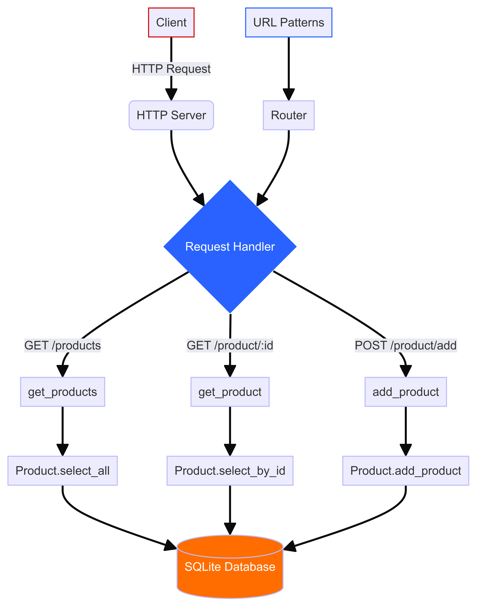

# E-commerce Server Request Handling

This document describes the flow of handling HTTP requests in the E-commerce server.

## Flowchart Overview

## Description

- **Client**: Initiates an HTTP request.
- **EcommerceRequestHandler (B)**: Handles incoming requests from the client.
- **Route Request (C)**: Determines the action based on the request method and URL.
- **Serve Swagger Spec (D)**: If the request is for `/swagger.json`, serves the Swagger specification.
- **Match URL Pattern (E)**: Matches the request URL to predefined routes.
- **Execute View Function (F)**: Executes the corresponding view function based on the matched URL pattern.
- **EcommerceController (H)**: Manages data interactions related to products or shopping carts.
- **Product / Cart (I)**: Represents the models or entities being managed.
- **Send JSON Response (J)**: Generates and sends a JSON response back to the client.
- **Return 404 (G)**: If no matching route is found, returns a "Not Found" response (404).
- **Client Receives Response (K)**: Receives the response from the server.

This flowchart illustrates the process of handling HTTP requests within the E-commerce server application. Each step corresponds to a specific action taken by the server to process and respond to client requests.
